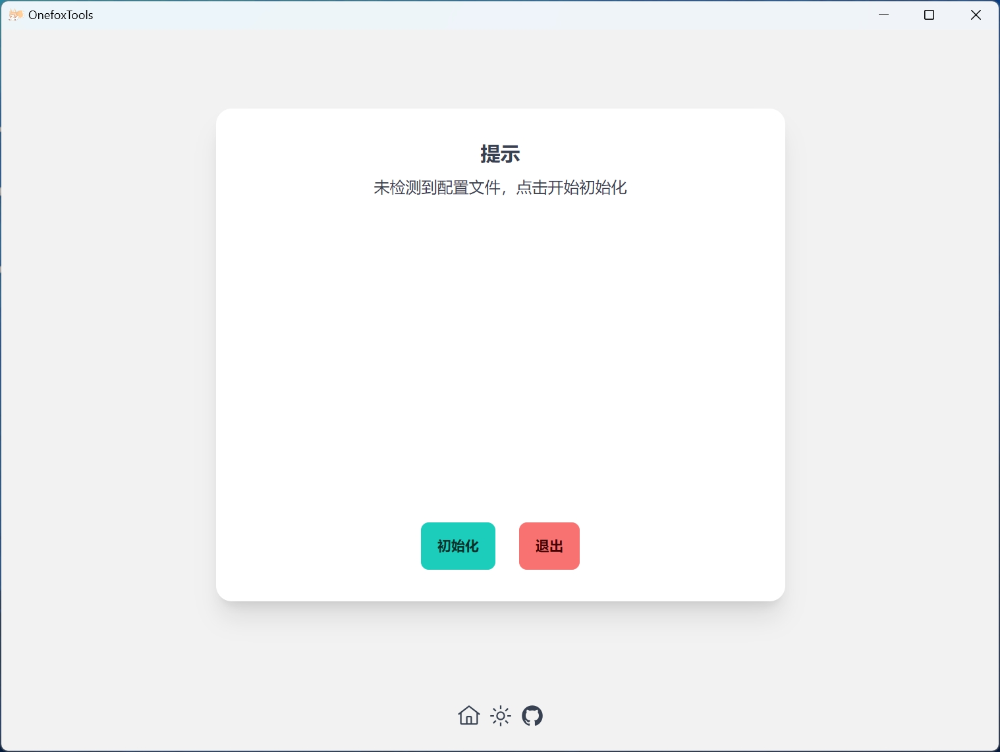
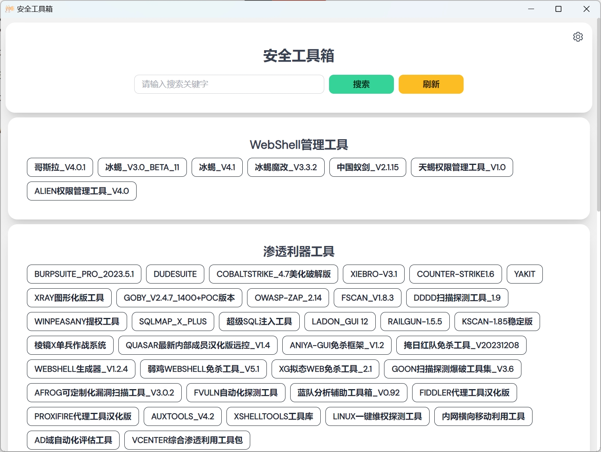
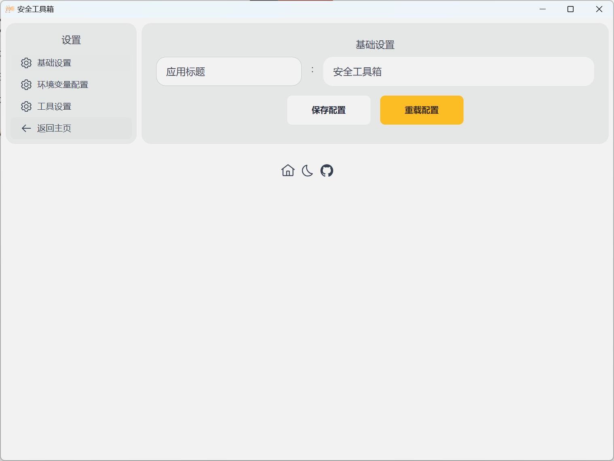
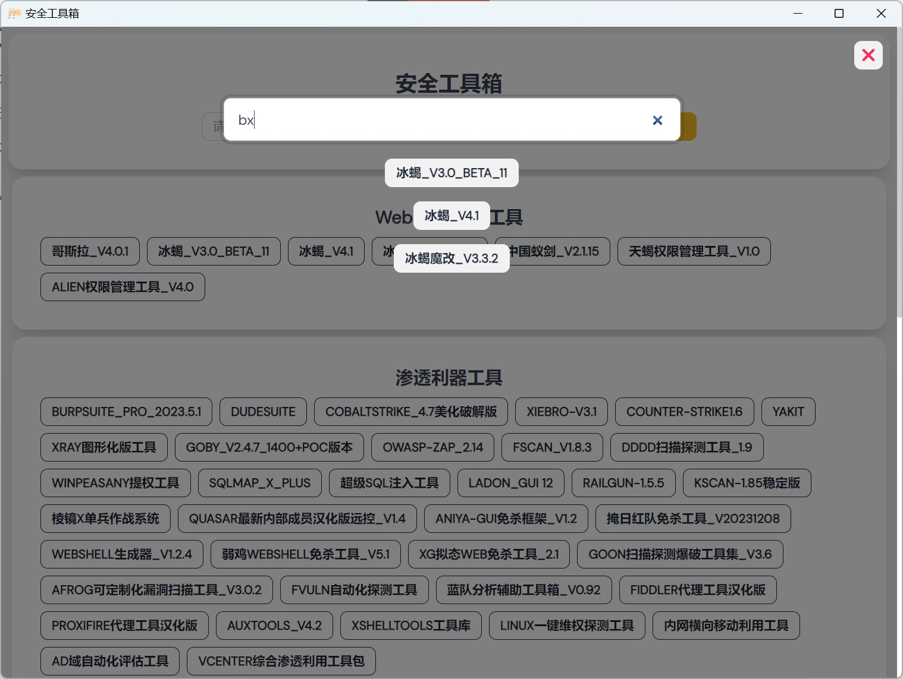

<h1  align="center">ONE-FOX集成工具箱-UI美化工具</h1>

<p align="center">
  <a href="https://github.com/wailsapp/wails/blob/master/LICENSE">
    
    
    
  </a>
</p>

## 导航

- [项目说明](#项目说明)
- [使用教程](#使用教程)
- [应用预览](#应用预览)
  - [首页](#首页)
  - [设置](#设置)
  - [搜索](#搜索)
- [编译说明](#编译说明)
- [License](#License)


## 项目说明

本项目在[ONE-FOX集成工具箱](https://github.com/One-Fox-Security-Team/One-Fox-T00ls)（下称狐狸工具箱）的基础上重新构建了一个UI，相比原版UI更加美观，增加了搜索功能。

理论上兼容狐狸工具箱v2-v8版。

本人非狐狸安全团队成员，之前在群里问过狐狸师傅一嘴说能二开，如有侵权，请联系ncxxg@outlook.com

## 使用教程

本项目不提供[ONE-FOX集成工具箱](https://github.com/One-Fox-Security-Team/One-Fox-T00ls)本体，请自己从公众号或者别处获取狐狸工具箱本体，也可以用自己正在使用的狐狸工具箱，本项目不会对正在使用的狐狸工具箱进行任何更改。

下载[releases](https://github.com/96368a/OnefoxTools-Mod/releases)中编译好的exe（不放心的可以自己编译），放入ONE-FOX集成工具箱的根目录，点击运行即可，初次运行请点击初始化配置文件。



## 应用预览

### 首页



### 设置



### 搜索



## 编译说明

本项目依赖于golang1.20+，[wails v2.0+](https://wails.io/)，[pnpm](https://pnpm.io)，请确保你已经拥有以上环境。

其中pnpm可使用npm、yarn代替，若要更换pnpm，请同步修改wails.json。

```shell
{
  ...
  "frontend:install": "pnpm install", // 可修改为npm install
  "frontend:build": "pnpm build",     // npm run build
  "frontend:dev:watcher": "pnpm dev", // npm run dev
  ...
}

```

以下为正常编译流程

1. 克隆项目到本地

```shell
git clone https://github.com/96368a/OnefoxTools-Mod
```

2. 安装go依赖

```shell
cd OnefoxTools-Mod
go mod tidy
```

3. 安装前端依赖

```shell
cd fronted
pnpm install
```

4. 编译

```shell
cd ..
wails build
```

额外说明: 本项目releases中的exe已采用upx压缩，自己编译时可以示情况自行选用。

## License

BSD 3-Clause License

Copyright (c) 2023, 木末君
